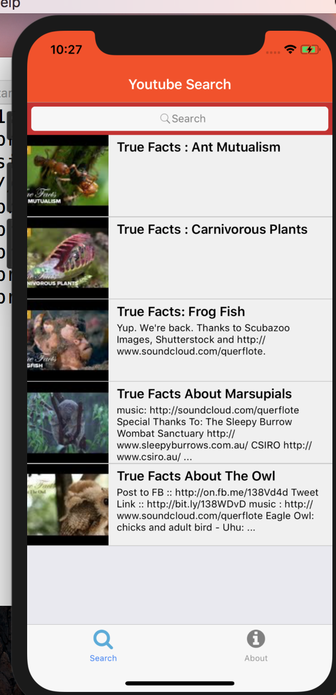
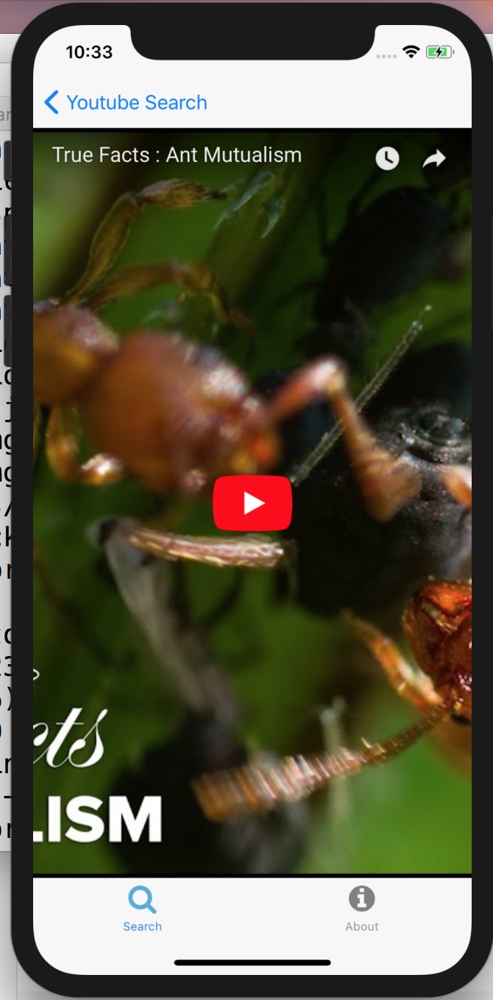

# Introduction

In this short assignment, I learnt how to to write React-Native to create a small App.

It allows us to search YouTube videos. It uses the Youtube API to fetch the videos from Youtube.

